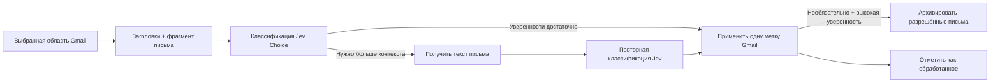

# jevMail

### Превратите перегруженный Gmail в понятную и полезную систему меток.

[English version](README.md)

Семантическая классификация писем на базе **Jev**: автоматизация с учётом
уверенности модели, контроль расходов и никакой серверной инфраструктуры jevMail.

[Почему jevMail](#почему-jevmail) · [Как это работает](#как-это-работает) ·
[Готовые наборы меток](#готовые-наборы-меток) · [Иллюстрированное руководство](guides-ru.md) · [Установка](#установка) ·
[Конфиденциальность](#конфиденциальность-и-обработка-данных) · [Вопросы и ответы](#часто-задаваемые-вопросы)

---

## Почта должна помогать принимать решения, а не становиться второй работой

Обычные фильтры хорошо распознают точных отправителей и ключевые слова, но
реальная почта устроена сложнее. Эскалация от клиента может звучать вежливо,
рассылка — содержать слово «срочно», а холодное коммерческое предложение —
выглядеть как личное знакомство. Важные письма приходят от незнакомых людей,
а привычные отправители продолжают присылать автоматические уведомления.

jevMail сопоставляет **смысл и намерение** каждого письма с правилами, которые
вы описываете обычным языком. Сервис отделяет вопросы, требующие решения, от
рутинных обновлений, поднимает срочные запросы, систематизирует чеки и
возможности и убирает из входящих нежелательные письма с высокой уверенностью.

В результате вам не приходится управлять ещё одним почтовым ящиком. Вы
продолжаете работать в привычном Gmail, но с метками, соответствующими вашему
реальному процессу.

## Посмотрите jevMail в действии

  <a href="assets/jevmail-screencast.mp4"><strong>▶ Посмотреть демонстрацию продукта</strong></a> 
  Откроется девятисекундное видео в формате MP4.

## Почему jevMail

| Возможность | Что она даёт |
| --- | --- |
| **Семантическая классификация** | Описывайте категории обычным языком вместо поддержки хрупких списков ключевых слов. |
| **Собственная система меток** | Создайте до 12 меток Gmail с критериями, подходящими вашей роли, компании, клиентам или личному процессу. |
| **Учёт уверенности модели** | Сначала оцениваются метаданные. Неоднозначные письма и письма, которые потенциально можно архивировать, при необходимости проходят повторную проверку по содержимому. |
| **Безопасная автоматизация** | Начните с режима предпросмотра, затем применяйте метки без архивации и включайте архивацию только для явно разрешённых категорий. |
| **Контроль расходов** | Задайте бюджет запуска, проверяемый перед каждым запросом, и отслеживайте стоимость, время обработки, прогресс и ошибки в интерфейсе. |
| **Личное развёртывание** | Приложение работает в проекте Google Apps Script внутри вашего аккаунта Google. У jevMail нет аккаунтов пользователей или собственной базы почтовых ящиков. |
| **Прозрачность решений** | Просматривайте выбранную метку, уверенность, источник решения и итоговое действие Gmail для последних писем. |
| **Повторяемая очистка** | Успешно обработанные письма получают техническую метку, поэтому последующие запуски могут их пропускать. |

## Почему Jev хорошо подходит для классификации почты

[Jev](https://docs.typesafe.ai/introduction) — флагманская модель **System One**
от TypeSafe. В отличие от обычной языковой модели, которая генерирует текст,
а затем требует его разбора, Jev создана для быстрых структурированных решений
в программных системах.

jevMail использует примитив Jev
[`Choice`](https://docs.typesafe.ai/primitives/choice): модель оценивает одно
письмо и выбирает ровно один вариант из заданных вами меток.

### Практические преимущества

- **Ответ из заданного набора.** Jev возвращает одну из разрешённых меток, а не
  придумывает новую категорию и не пишет развёрнутый текст.
- **Понимание естественного языка.** В критериях можно описать намерение,
  срочность, отношения, исключения и деловой контекст, а не только совпадения слов.
- **Распределение вероятностей и уверенность.** Результат содержит вероятности
  по всем доступным вариантам и показатель уверенности. Сконцентрированное
  распределение означает более однозначное решение, а равномерное —
  неопределённость.
- **Неопределённость меняет поведение системы.** jevMail может принять уверенное
  решение по метаданным или загрузить текст письма и выполнить повторную
  классификацию, если требуется больше контекста.
- **Экономика, ориентированная на решения.** Jev тарифицирует входные токены и
  не взимает плату за выходные. Благодаря этому массовая классификация остаётся
  доступной.
- **Без дообучения на данных клиентов.** По заявлению TypeSafe, Jev не
  дообучается на пользовательских данных, а запросы и ответы клиентов не
  используются для обучения модели. Подробнее — в разделе
  [о моделях Jev и обработке данных](https://docs.typesafe.ai/models).

Уверенность — полезный управляющий сигнал, но не гарантия безошибочности каждого
решения. Начинайте с предпросмотра, не включайте действия с последствиями и
настраивайте критерии и пороги на примерах из собственного почтового ящика.

> **Примечание о языках:** основной язык обучения Jev — английский, и сейчас
> модель наиболее точна именно на нём. Другие языки поддерживаются, но TypeSafe
> рекомендует проверить качество на репрезентативной выборке до включения
> автоматических действий.

## Как это работает

1. **Вы выбираете область обработки.** Можно обработать входящие или всю почту,
   ограничиться непрочитанными письмами и задать размер выборки.
2. **Сначала используются метаданные.** Для первой экономичной классификации
   jevMail отправляет заголовки письма и фрагмент, предоставленный Gmail.
3. **Jev выбирает одну настроенную метку.** Каждое письмо оценивается отдельно;
   содержимое разных писем никогда не объединяется в один контекст модели.
4. **Для неоднозначных писем добавляется контекст.** Если уверенность по
   метаданным ниже вашего порога или решение об архивации требует более веских
   оснований, приложение получает текст и повторно классифицирует то же письмо.
5. **Каждое решение сохраняется до изменения Gmail.** В обычном запуске
   применяется выбранная метка. Если включена архивация, из входящих удаляются
   только письма с метками, для которых разрешена архивация, и только при
   превышении соответствующего порога уверенности.
6. **Прогресс остаётся видимым.** Панель показывает число обработанных писем,
   решений только по метаданным, проверок полного текста, архивированных писем,
   ошибок, а также стоимость API и активное время обработки.

Архивация означает удаление метки `INBOX`. jevMail **не удаляет** письма и не
перемещает их в папки «Спам» или «Корзина» Gmail.

## Стоимость: рассчитано на масштабы почтового ящика

Сейчас TypeSafe указывает для Jev 1.13 цену **$0,042 за миллион входных
токенов**, при этом выходные токены бесплатны. При такой ставке примерная
стоимость выглядит следующим образом:

| Пример нагрузки | Предполагаемый объём | Примерная стоимость модели |
| --- | ---: | ---: |
| Одна классификация | 1 000 токенов | $0,000042 |
| 1 000 писем | по 1 000 токенов | $0,042 |
| 10 000 писем | по 1 000 токенов | $0,42 |
| 50 000 писем | по 1 000 токенов | $2,10 |

Это иллюстрации, а не ценовое предложение. Фактический расход зависит от
описаний меток, длины писем, частоты проверки полного текста и тарифов
OpenRouter. jevMail позволяет задать максимальную стоимость запуска и не
начинает очередной запрос к модели, если он может превысить лимит.

Актуальные ставки смотрите в разделе
[тарифов моделей TypeSafe](https://docs.typesafe.ai/models), а фактические
расходы — в [истории OpenRouter](https://openrouter.ai/activity).

Предварительная проверка бюджета использует консервативную оценку. Если запрос
завершается по тайм-ауту или сведения об использовании недоступны, оценочная
сумма остаётся зарезервированной в итогах сессии. Фактическое списание может
отличаться; дополнительную защиту даёт лимит расходов ключа OpenRouter.
Сохранённое решение можно повторно применить после ошибки записи в Gmail, не
отправляя письмо модели ещё раз.

## Готовые наборы меток

Каждое письмо получает **одну** настроенную классификационную метку. Поэтому
качественный набор состоит из различимых, проверяемых категорий, которые вместе
охватывают весь почтовый ящик.

### Универсальная почта — набор по умолчанию

Набор по умолчанию — это полная и безопасная система, а не простая шкала
важности. Она разделяет действия, контекст, отношения, транзакции, чтение,
автоматические уведомления, холодные обращения и опасные письма. У каждой
категории есть чёткие границы, а `review` служит безопасным вариантом для
неоднозначных случаев.

| Метка Gmail | Рекомендуемые критерии классификации | Можно архивировать? |
| --- | --- | :---: |
| `action-required` | Подлинное письмо, которое требует ответа, решения, согласования, выполнения задачи или срочного вмешательства. Включает нерешённые проблемы с доступом, безопасностью, оплатой, доставкой, юридическими вопросами или аккаунтом. Не включает необязательное чтение и обычные подтверждения. | Нет |
| `important-update` | Существенное обновление от доверенного человека, проекта, клиента, работодателя, учебного заведения, сервиса или аккаунта, которое следует сохранить, но которое сейчас не требует действий. | Нет |
| `personal` | Личная переписка с семьёй, друзьями или знакомым участником сообщества. Не включает бизнес-автоматизацию, транзакции и нежелательные коммерческие обращения. | Нет |
| `money-and-orders` | Чеки, счета, подтверждения, сведения о заказах и доставке, банковские уведомления и официальные финансовые документы, если они не содержат нерешённой проблемы. | Нет |
| `opportunities` | Конкретная и заслуживающая доверия возможность по работе, бизнесу, партнёрству, выступлению, медиа, финансированию или совместному проекту с релевантным контекстом. Не включает массовые предложения. | Нет |
| `newsletters` | Регулярные редакционные, продуктовые, отраслевые, авторские или общественные рассылки, на которые пользователь подписался и которые предназначены для чтения позже. | Нет |
| `routine-notifications` | Низкорисковые автоматические уведомления из соцсетей, приложений, систем мониторинга, дайджестов и других систем, не требующие действий. Не включает оповещения о безопасности, доступе, оплате, доставке, юридических вопросах и сбоях сервисов. | Да |
| `cold-outreach` | Нежелательные коммерческие, рекрутинговые, PR-, SEO-, агентские, спонсорские предложения или обмен ссылками без релевантных активных отношений или переписки. | Да |
| `junk` | Фишинг, мошенничество, обманная реклама, нерелевантный массовый спам, вредоносные запросы или бессвязные одноразовые письма. | Да |
| `review` | Подлинное или неоднозначное письмо, которое нельзя уверенно отнести к другой настроенной категории. | Нет |

После применения меток поиск Gmail становится заметно полезнее, например:
`label:action-required older_than:3d`, `label:opportunities` или
`label:money-and-orders after:2026/01/01`.

### Готовые наборы меток для разных аудиторий

Все наборы ниже доступны прямо в селекторе **Label playbook** приложения.
После загрузки набор заполняет редактор, а каждую метку, критерий и настройку
архивации можно изменить до сохранения или использования.

<strong>Основатели, руководители и операционные менеджеры</strong>

| Метка | Критерии, которые можно использовать или адаптировать |
| --- | --- |
| `decision-required` | Подлинное письмо, требующее от получателя одобрить, отклонить, выбрать, подписать, расставить приоритеты или принять деловое решение. Не включает информационные обновления без явного решения. |
| `customer-risk` | Клиент или партнёр сообщает о сильном недовольстве, намерении отказаться от услуг, сорванной доставке, серьёзном сбое, споре об оплате или другой проблеме, угрожающей выручке или доверию. |
| `investor-and-board` | Прямая переписка с действующими инвесторами, членами совета директоров или потенциальными инвесторами о привлечении средств, управлении, результатах, знакомствах или стратегии компании. Не включает массовые инвесторские рассылки. |
| `team-blocker` | Коллега не может продолжить важную работу без ответа, доступа, согласования или вмешательства получателя. |
| `delegatable` | Подлинный операционный запрос, который требует действий, но может быть обоснованно передан финансовому, юридическому, клиентскому, рекрутинговому или другому подразделению. |
| `vendor-pitch` | Нежелательное предложение от поставщика, агентства, разработчика ПО, рекрутера, PR- или консалтинговой компании без активной оценки или существующих отношений. |
| `review` | Подлинное или неоднозначное письмо, которое нельзя уверенно отнести к другой категории для руководителей. |

<strong>Продажи и развитие бизнеса</strong>

| Метка | Критерии, которые можно использовать или адаптировать |
| --- | --- |
| `hot-lead` | Потенциальный клиент выражает конкретный интерес к покупке: запрашивает цену, демонстрацию, сведения о безопасности, предложение, этапы закупки либо упоминает бюджет, полномочия, потребность или сроки. |
| `deal-action` | Активная переписка с потенциальным или действующим клиентом требует ответа, продолжения после встречи, документа, шага в переговорах или внутреннего обязательства для продвижения сделки. |
| `partner-opportunity` | Релевантное предложение об интеграции, дистрибуции, совместном маркетинге, рекомендациях, перепродаже, маркетплейсе или стратегическом партнёрстве с признаками взаимной выгоды. |
| `customer-success` | Действующий клиент просит о помощи, адаптации, расширении, продлении, консультации по продукту или сообщает о риске для удержания. |
| `sales-automation` | Уведомления CRM, оповещения о лидах, итоги звонков, отчёты цепочек и другие автоматические сообщения отдела продаж, не требующие личного ответа. |
| `irrelevant-outreach` | Нежелательное предложение инструментов или услуг самому отделу продаж, а не интерес потенциального клиента к продукту компании. |
| `review` | Подлинное или неоднозначное письмо, которое нельзя уверенно отнести к другой категории продаж и развития бизнеса. |

<strong>Инвесторы, венчурные фонды и бизнес-ангелы</strong>

| Метка | Критерии, которые можно использовать или адаптировать |
| --- | --- |
| `founder-intro` | Заслуживающее доверия знакомство с основателем или компанией, желательно через известный контакт или с конкретным объяснением соответствия инвестиционному тезису. |
| `active-deal` | Переписка о компании, которая уже находится на рассмотрении: материалы проверки, доступ к виртуальной комнате данных, встреча с партнёрами, рекомендации, условия, аллокация или работа инвестиционного комитета. |
| `portfolio-action` | Основатель портфельной компании просит о знакомстве, помощи с наймом или привлечением средств, стратегическом совете, эскалации или другом конкретном действии. |
| `lp-and-fund` | Переписка с партнёрами с ограниченной ответственностью, администраторами фонда, юристами, аудиторами или подрядчиками о привлечении средств, отчётности, требованиях капитала, комплаенсе или работе фонда. |
| `ecosystem-update` | Релевантное исследование рынка, информация о демо-дне, обновление акселератора или отраслевые новости, которые стоит прочитать, но которые не требуют немедленного ответа. |
| `mass-fundraising-pitch` | Шаблонное или автоматическое предложение о привлечении средств с минимальной персонализацией, неясным соответствием тезису или без надёжной рекомендации. |
| `review` | Подлинное или неоднозначное письмо, которое нельзя уверенно отнести к другой категории для инвесторов и фондов. |

<strong>Подбор персонала и HR-операции</strong>

| Метка | Критерии, которые можно использовать или адаптировать |
| --- | --- |
| `candidate-action` | Кандидат задаёт содержательный вопрос, предоставляет запрошенные сведения или ожидает ответа для продолжения активного процесса найма. |
| `interview-scheduling` | Доступное время, подтверждение, перенос, координация интервьюеров или организационные вопросы собеседования и найма. |
| `offer-and-closing` | Обсуждение предложения, вопросы о компенсации, рекомендации, проверка биографии, дата выхода, переговоры или другой поздний этап найма. |
| `employee-sensitive` | Личный, конфиденциальный, рабочий вопрос о результатах, благополучии, жалобе или политике, который требует внимательного рассмотрения человеком. Никогда не архивировать автоматически. |
| `ats-automation` | Автоматические подтверждения заявок, статусы, напоминания о собеседованиях или отчёты рекрутинговых систем, не требующие ручного ответа. |
| `recruiting-vendor-pitch` | Нежелательное предложение кадрового агентства, сайта вакансий, инструмента поиска, услуги по бренду работодателя или рекрутингового ПО. |
| `review` | Подлинное или неоднозначное письмо, которое нельзя уверенно отнести к другой категории найма и HR-операций. |

<strong>Фрилансеры, консультанты и авторы</strong>

| Метка | Критерии, которые можно использовать или адаптировать |
| --- | --- |
| `qualified-opportunity` | Конкретное предложение оплачиваемого проекта, спонсорства, сотрудничества или консультации с релевантным объёмом работ, сроками, признаками бюджета и надёжным отправителем. |
| `client-action` | Действующий клиент запрашивает результат, решение, правку, встречу, согласование или сведения, необходимые для продвижения текущей работы. |
| `payment-and-contract` | Договоры, технические задания, счета, подтверждения оплаты, налоговые формы, закупки или юридические условия оплачиваемой работы. |
| `audience-and-community` | Содержательные письма от читателей, зрителей, участников сообщества или коллег с обратной связью, вопросами или ценностью для отношений. |
| `platform-update` | Обычные уведомления платформ публикации, аналитики, торговли, бронирования или авторских сервисов, не требующие немедленных действий. |
| `low-quality-collab` | Шаблонные предложения подарков, партнёрских программ, гостевых публикаций, обратных ссылок, работы только за упоминание или массового спонсорства без релевантных условий и настоящей персонализации. |
| `review` | Подлинное или неоднозначное письмо, которое нельзя уверенно отнести к другой категории для фрилансеров, консультантов или авторов. |

<strong>Поддержка клиентов и электронная коммерция</strong>

| Метка | Критерии, которые можно использовать или адаптировать |
| --- | --- |
| `urgent-escalation` | Проблема безопасности, мошенничества, юридического характера, доступа к аккаунту, массового сбоя или серьёзного влияния на клиента, требующая немедленного рассмотрения человеком. |
| `refund-or-billing` | Клиент спрашивает о списании, счёте, возврате, двойной оплате, неудачном платеже, отмене или оплате подписки. |
| `delivery-or-order` | Статус заказа, задержанная или пропавшая доставка, повреждённый или неверный товар, возврат, обмен либо ошибка адреса доставки. |
| `product-help` | Клиенту нужны инструкции, устранение неполадок, информация о совместимости, помощь с началом работы или использованием продукта. |
| `feedback-and-feature` | Отзыв о продукте, запрос функции, обзор, ответ на опрос или предложение, не требующее срочной поддержки. |
| `automated-system-mail` | Отчёты мониторинга, подтверждения обращений, обычные уведомления платформ и другая автоматическая операционная почта без прямого запроса клиента. |
| `review` | Подлинное или неоднозначное письмо, которое нельзя уверенно отнести к другой категории поддержки или электронной коммерции. |

### Как составлять более точные критерии для Jev

1. **Описывайте наблюдаемые признаки.** Формулировка «запрашивает цену или
   демонстрацию» полезнее, чем «хороший лид».
2. **Добавляйте исключения.** Если категория пересекается с другой меткой,
   прямо укажите, что в неё не входит.
3. **Разделяйте категории по смыслу.** Jev должна выбрать один вариант Choice,
   поэтому избегайте нескольких меток почти с одинаковым значением.
4. **Определяйте срочность, а не просто используйте это слово.** Отличайте
   реальные сроки, инциденты и блокирующие проблемы от маркетинговых фраз вроде
   «срочное предложение».
5. **Добавьте безопасную универсальную категорию.** Метка `other` или `review`
   не позволит принудительно отнести неоднозначное подлинное письмо к категории
   с разрешённой архивацией.
6. **Автоматизируйте только низкорисковые категории.** На первых этапах
   разрешайте архивацию только для очевидно ненужной почты и никогда — для
   вопросов безопасности, финансов, права, клиентов или личной переписки.

## Руководства

Следуйте **[иллюстрированному руководству по установке и первому запуску](guides-ru.md)**:
в нём показана вся последовательность от создания проекта Apps Script до
безопасного предпросмотра десяти писем, включая экраны авторизации и
развёртывания, рекомендуемые настройки, обновление и устранение неполадок.

## Установка

### Перед началом

Вам понадобятся:

- аккаунт Google с Gmail;
- [аккаунт OpenRouter](https://openrouter.ai/) с небольшим положительным балансом;
- около 10 минут на первое развёртывание.

### 1. Создайте личный проект Apps Script

1. Откройте [Google Apps Script](https://script.google.com/).
2. Нажмите **New project** и присвойте проекту понятное имя, например `jevMail`.
3. Откройте стандартный файл скрипта, удалите его содержимое и вставьте полный
   текст файла [`CODE.gs`](CODE.gs).
4. Сохраните проект.

### 2. Подключите Gmail API

1. Найдите раздел **Services** на боковой панели Apps Script.
2. Нажмите **+ Add a service**.
3. Выберите **Gmail API**, затем нажмите **Add**.

Google описывает этот процесс в руководстве по
[расширенным сервисам Google](https://developers.google.com/apps-script/guides/services/advanced).

### 3. Разверните приложение как приватное веб-приложение

1. Выберите **Deploy → New deployment**.
2. В качестве типа развёртывания укажите **Web app**.
3. Для личной установки выберите **Execute as: Me**.
4. Ограничьте доступ значением **Only myself**, если оно доступно для вашего аккаунта.
5. Нажмите **Deploy**, изучите запрашиваемые разрешения Google и скопируйте URL
   веб-приложения.

Подтверждайте авторизацию только для созданного вами проекта Apps Script, код
которого вы проверили. Google объясняет параметры запуска и доступа в
[руководстве по веб-приложениям](https://developers.google.com/apps-script/guides/web).

### 4. Подключите OpenRouter

1. Откройте развёрнутый jevMail по полученному URL.
2. Создайте или скопируйте ключ на странице
   [OpenRouter Keys](https://openrouter.ai/workspaces/default/keys).
3. Вставьте его в поле **OpenRouter API key**.
4. Оставьте включённым **Store this key in Apps Script User Properties**, если
   хотите использовать ключ в следующих сессиях.
5. Нажмите **Verify connection**.

Используйте отдельный ключ для jevMail и при необходимости установите в
OpenRouter лимит расходов аккаунта или ключа.

В [иллюстрированном руководстве](guides-ru.md#openrouter-key-limit) показано,
как создать отдельный ключ, задать срок действия и установить лимит расходов
до подключения к jevMail.

### 5. Выполните безопасный тестовый запуск

Рекомендуемые настройки первого запуска:

| Настройка | Рекомендуемое начальное значение |
| --- | --- |
| Email source | Inbox |
| Message limit | 10 — validation sample |
| Processing mode | Apply labels only |
| Unread only | Enabled |
| Preview only | Enabled |
| Maximum processing cost | $0.01–$0.10 |

Настройте метки, нажмите **Save classification rules** и запустите предпросмотр.
Изучите последние результаты и скорректируйте критерии, если письма попадают не
в те категории. Затем отключите **Preview only** и выполните небольшой реальный
запуск. Включайте автоматическую архивацию только после нескольких успешных
проверок.

### Обновление установленной версии

После замены `CODE.gs` на новую версию откройте **Deploy → Manage deployments**,
отредактируйте существующее развёртывание, выберите новую версию и разверните
её. Сохранённые правила и API-ключ останутся в User Properties проекта, пока вы
не удалите их явно.

## Конфиденциальность и обработка данных

jevMail спроектирован так, чтобы свести инфраструктуру к минимуму и сделать
путь данных прозрачным. Вы развёртываете приложение самостоятельно, однако для
классификации выбранные данные писем всё равно отправляются внешнему сервису модели.

### Что остаётся внутри вашего аккаунта Google

- Код приложения выполняется в вашем проекте Google Apps Script.
- Доступ к Gmail контролируется OAuth-авторизацией Google для этого проекта.
- Правила меток, состояние обработки и при желании сохранённый ключ OpenRouter
  хранятся в **User Properties** Apps Script, которые Google привязывает к
  текущему пользователю скрипта.
- Метки Gmail и архивирование применяются напрямую через Gmail API.
- jevMail не содержит собственного сервера приложения, базы пользователей,
  аналитического конвейера или копии вашего почтового ящика.

### Что отправляется для классификации

Для каждого выбранного письма jevMail отправляет в OpenRouter:

- названия и описания настроенных меток;
- выбранные заголовки Gmail, включая отправителя, получателей, тему, дату и
  признаки списка рассылки или цепочки;
- фрагмент письма, сформированный Gmail;
- текст письма только тогда, когда политика уверенности требует проверки
  полного содержимого;
- API-ключ OpenRouter для авторизации запроса.

Запросы независимы: содержимое одного письма никогда не объединяется с
содержимым другого. jevMail не отправляет вложения, изображения, аудио и видео.

OpenRouter передаёт входные данные выбранному поставщику модели. Политики
хранения данных и обучения у поставщиков могут различаться, поэтому перед
обработкой конфиденциальной почты изучите
[политику конфиденциальности и журналирования OpenRouter](https://openrouter.ai/docs/features/privacy-and-logging),
[политику конфиденциальности OpenRouter](https://openrouter.ai/privacy/) и
настройки своего аккаунта. TypeSafe заявляет, что Jev не обучается на запросах
и ответах клиентов; подробнее — в разделе
[обработки данных TypeSafe](https://docs.typesafe.ai/models#data-handling).

### Встроенные меры безопасности

- **Preview only** выполняет классификацию, не изменяя Gmail.
- **Apply labels only** запрещает архивацию во время проверки системы меток.
- **Разрешение на архивацию задаётся отдельно** для каждой метки.
- **Для архивации используется отдельный, более высокий порог уверенности.**
- **Лимит стоимости запуска** прекращает новые запросы к модели при достижении бюджета.
- Кнопка **Stop processing** доступна во время активной сессии.
- jevMail никогда не удаляет письма, не отправляет ответы и не пересылает почту.

Проект не заменяет проверку требований вашей организации к безопасности,
конфиденциальности, праву и нормативному соответствию. Не обрабатывайте
регулируемую или особо конфиденциальную почту, пока политики OpenRouter и
поставщика модели не будут соответствовать вашим требованиям.

## Часто задаваемые вопросы

### Может ли jevMail удалить мои письма?

Нет. Он применяет метки Gmail. Необязательная архивация удаляет метку `INBOX`,
но не удаляет письмо и не перемещает его в «Спам» или «Корзину».

### Может ли приложение изменить метки без моего разрешения?

Только после того, как вы отключите **Preview only** и запустите обработку.
Сначала используйте предпросмотр, затем режим **Apply labels only** и лишь после
этого включайте действия по архивации.

### Читает ли jevMail полный текст каждого письма?

Нет. Сначала оцениваются метаданные и фрагмент Gmail. Текст запрашивается только
тогда, когда уверенность результата по метаданным ниже заданного порога или
когда решение, связанное с архивацией, требует более веских оснований.

### Можно ли использовать собственные метки?

Да. Вы можете создать до 12 меток, описать каждую обычным языком и определить,
какие малоценные категории допускают архивацию.

### Почему письмо получило неправильную метку?

Возможные причины — пересекающиеся критерии, недостаток контекста, нечёткая
универсальная категория или неопределённость модели. Сделайте критерии более
различимыми, добавьте исключения, проверьте их на репрезентативных письмах и
повысьте пороги до автоматизации важных действий.

### Работает ли приложение с языками, кроме английского?

Jev принимает многоязычные тексты, но TypeSafe называет английский самым
сильным языком модели. Для неанглоязычной почты проверьте точность на своих
письмах до включения изменений или архивации.

### Как повторно обработать старые письма?

Успешно обработанные письма получают техническую метку `jev-triaged`, чтобы
последующие запуски могли их пропустить. Удалите эту метку с писем, которые
нужно обработать повторно, и начните новую сессию.

### Почему вкладка браузера должна оставаться открытой?

Интерфейс запускает последовательность коротких вызовов Apps Script, чтобы
показывать прогресс и учитывать ограничения времени выполнения Apps Script.
Не закрывайте вкладку до завершения или безопасной приостановки сессии.

## Важные ограничения

- ИИ может ошибаться; показатель уверенности снижает риск, но не устраняет его.
- За один запуск каждое письмо получает ровно одну настроенную метку классификации.
- Анализируется только текст; вложения и медиафайлы не обрабатываются.
- Продолжают действовать квоты Apps Script, Gmail API, OpenRouter и поставщика модели.
- При обработке через браузер вкладка jevMail должна оставаться открытой.
- Проект предоставляется «как есть»; тщательно протестируйте его перед архивацией.

## Документация и сервисы

| Ресурс | Ссылка |
| --- | --- |
| Иллюстрированное руководство по установке и первому запуску | [`guides-ru.md`](guides-ru.md) |
| Введение в Jev | [docs.typesafe.ai/introduction](https://docs.typesafe.ai/introduction) |
| Концепция System One | [docs.typesafe.ai/concepts/system-one](https://docs.typesafe.ai/concepts/system-one) |
| Классификация Choice | [docs.typesafe.ai/primitives/choice](https://docs.typesafe.ai/primitives/choice) |
| Уверенность | [docs.typesafe.ai/confidence](https://docs.typesafe.ai/confidence) |
| Модели Jev, цены и обработка данных | [docs.typesafe.ai/models](https://docs.typesafe.ai/models) |
| OpenRouter | [openrouter.ai](https://openrouter.ai/) |
| Создание API-ключа OpenRouter | [openrouter.ai/workspaces/default/keys](https://openrouter.ai/workspaces/default/keys) |
| Конфиденциальность OpenRouter | [openrouter.ai/docs/features/privacy-and-logging](https://openrouter.ai/docs/features/privacy-and-logging) |
| Google Apps Script | [script.google.com](https://script.google.com/) |
| Руководство по веб-приложениям Apps Script | [developers.google.com/apps-script/guides/web](https://developers.google.com/apps-script/guides/web) |
| Gmail API | [developers.google.com/gmail/api](https://developers.google.com/gmail/api) |

## Благодарности

- **Модель принятия решений:** [TypeSafe — Jev](https://typesafe.ai/)
- **Доступ к модели и оплата:** [OpenRouter](https://openrouter.ai/)
- **Почтовый ящик и среда выполнения:** [Gmail](https://mail.google.com/) и
  [Google Apps Script](https://script.google.com/)
- **Продукт и реализация:** [Ilia AGI](https://github.com/ilyamk)

---

**Умные метки. Меньше шума. Больше времени на действительно важную работу.**

[Создать ключ OpenRouter](https://openrouter.ai/workspaces/default/keys) ·
[Открыть документацию Jev](https://docs.typesafe.ai/introduction) ·
[Открыть Google Apps Script](https://script.google.com/)

