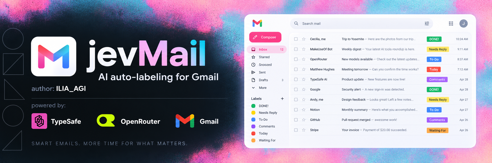
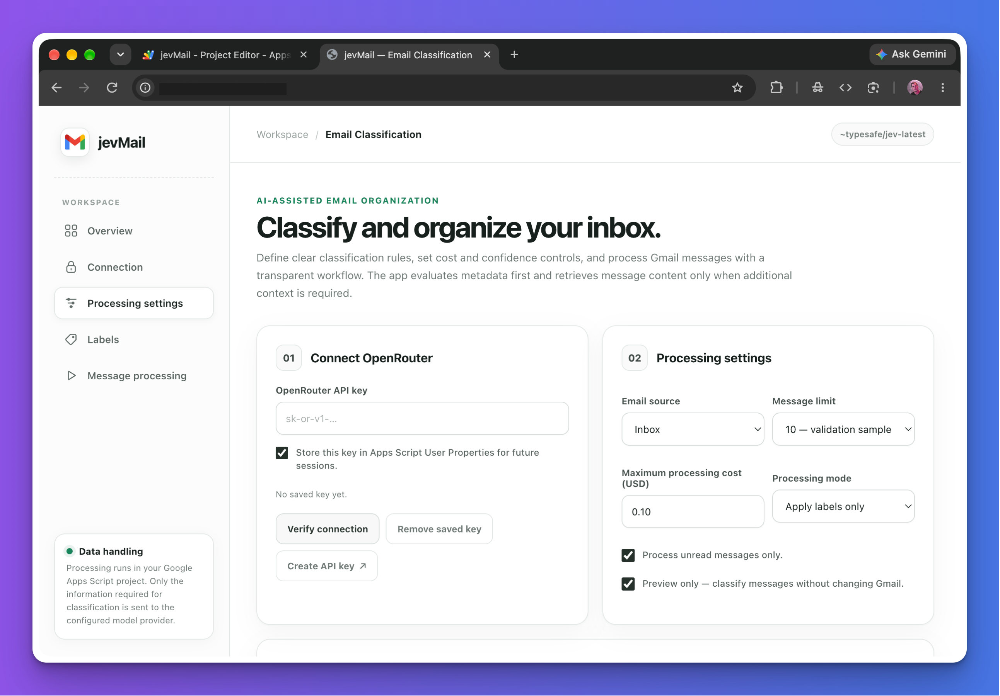
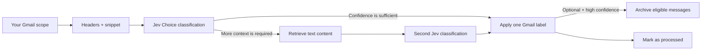

# jevMail

### Turn an overloaded Gmail inbox into a small, useful system of labels.

[Русская версия](README-ru.md)

Semantic email classification powered by **Jev**, with confidence-aware automation,
cost controls, and no jevMail-operated backend.

[Why jevMail](#why-jevmail) · [How it works](#how-it-works) ·
[Label playbooks](#label-playbooks) · [Visual guide](guides.md) · [Setup](#setup) ·
[Privacy](#privacy-and-data-handling) · [FAQ](#frequently-asked-questions)

---

## Your inbox should be a decision system, not a second job

Email filters are good at exact senders and keywords. Real inboxes are not.
A customer escalation can look polite. A newsletter can contain the word
“urgent.” A cold sales pitch can imitate a personal introduction. Important
messages arrive from people you have never met, while familiar senders still
send automated noise.

jevMail classifies the **meaning and intent** of each message against rules you
write in plain English. It can separate work that needs a decision from routine
updates, surface time-sensitive requests, organize receipts and opportunities,
and move high-confidence unwanted mail out of the inbox.

The result is not another inbox to manage. The result is your existing Gmail,
with labels that match how you actually work.

## See jevMail in action

  <a href="assets/jevmail-screencast.mp4"><strong>▶ Watch the product walkthrough</strong></a> 
  Opens the 9-second MP4 walkthrough.

## Why jevMail

| Capability | What it gives you |
| --- | --- |
| **Semantic classification** | Describe a category in natural language instead of maintaining fragile keyword lists. |
| **Your own taxonomy** | Create up to 12 Gmail labels with criteria tailored to your role, company, clients, or personal workflow. |
| **Confidence-aware processing** | Metadata is evaluated first. Ambiguous or archive-sensitive messages can receive a second review using message content. |
| **Safe automation** | Start in preview mode, apply labels without archiving, and enable archiving only for explicitly eligible categories. |
| **Cost control** | Set a run budget checked before each request and see processing cost, elapsed time, progress, and errors in the UI. |
| **Personal deployment** | The application runs from a Google Apps Script project in your own Google account. There is no jevMail account or hosted mailbox database. |
| **Explainable operations** | Review the selected label, confidence, decision source, and resulting Gmail action for recent messages. |
| **Repeatable cleanup** | Successfully processed messages receive a technical marker so later runs can skip them. |

## Why Jev is a strong fit for email classification

[Jev](https://docs.typesafe.ai/introduction) is TypeSafe's flagship **System One
model**. Unlike a conventional language model that generates prose and then
needs its output parsed, Jev is designed to make fast, structured decisions for
software.

jevMail uses Jev's [`Choice`](https://docs.typesafe.ai/primitives/choice)
primitive: the model evaluates one email and selects exactly one option from the
labels you defined.

### The practical advantages

- **Constrained answers.** Jev returns one of the allowed labels rather than
  inventing a new category or producing an essay.
- **Natural-language understanding.** Criteria can describe intent, urgency,
  relationships, exclusions, and business context—not just matching words.
- **Probability distribution and confidence.** A result includes probabilities
  across the available options and a confidence signal. Concentrated
  probabilities indicate a clearer decision; a flatter distribution signals
  ambiguity.
- **Uncertainty can change behavior.** jevMail can accept a confident metadata
  decision or retrieve message content for a second classification when more
  context is required.
- **Decision-focused economics.** Jev is priced by input tokens and does not
  charge for output tokens. That makes high-volume classification practical.
- **No customer-data fine-tuning.** TypeSafe states that Jev is not fine-tuned
  on customer data and that customer requests and responses are not used to
  train the model. See [Jev models and data handling](https://docs.typesafe.ai/models).

Confidence is a useful control signal, not a guarantee that every individual
decision is correct. Begin with preview runs, keep destructive actions disabled,
and tune criteria and thresholds against your own inbox.

> **Language note:** English is Jev's primary training language and currently
> provides its strongest accuracy. Other languages are accepted, but TypeSafe
> recommends testing them on representative data before relying on automation.

## How it works

1. **You choose the scope.** Process the Inbox or All Mail, optionally limited
   to unread messages and a fixed sample size.
2. **Metadata comes first.** jevMail sends message headers and a Gmail snippet
   for a low-data, low-cost first classification.
3. **Jev selects one configured label.** Every email is evaluated independently;
   content from different messages is never combined into one model context.
4. **Ambiguous messages receive more context.** If metadata confidence is below
   your threshold—or an archive action requires stronger evidence—the app
   retrieves text content and classifies the same message again.
5. **Each decision is saved before Gmail is updated.** A normal run applies the selected label. If
   you enabled archiving, only labels marked **Archive eligible** can be removed
   from the Inbox, and only above the archive-confidence threshold.
6. **Progress remains visible.** The dashboard shows processed messages,
   metadata-only decisions, full-content reviews, archived messages, errors,
   API cost, and active processing time.

Archiving means removing the `INBOX` label. jevMail does **not** delete messages
and does not move them to Gmail's Spam or Trash folders.

## Cost: designed for inbox-scale work

TypeSafe currently publishes a Jev 1.13 rate of **$0.042 per million input
tokens**, with output tokens free. At that rate, the following simplified
examples illustrate the economics:

| Example workload | Assumed input | Model cost illustration |
| --- | ---: | ---: |
| One classification | 1,000 tokens | $0.000042 |
| 1,000 messages | 1,000 tokens each | $0.042 |
| 10,000 messages | 1,000 tokens each | $0.42 |
| 50,000 messages | 1,000 tokens each | $2.10 |

These are illustrations, not quotes. Actual usage depends on label definitions,
message length, how often full-content review is required, and the pricing shown
by OpenRouter. jevMail lets you set a maximum spend before a run and stops before
starting another model request when the configured limit would be exceeded.

See [TypeSafe model pricing](https://docs.typesafe.ai/models) and your
[OpenRouter activity](https://openrouter.ai/activity) for current rates and
actual usage.

The pre-request budget check uses a conservative estimate. When a request times
out or usage is unavailable, that estimate remains reserved in the session total.
Actual provider charges can differ; use an OpenRouter key spending limit for an
additional account-side control. A saved decision can be retried after a Gmail
write failure without sending the message to the model again.

## Label playbooks

Each message receives **one** configured classification label. A strong label
set therefore uses categories that are distinct, observable, and collectively
cover the inbox.

### Universal inbox — the default playbook

The default is designed as a complete, low-risk taxonomy rather than a simple
importance scale. It separates action, context, relationships, transactions,
reading, automation, outreach, and unsafe mail. Every category includes a
boundary, and `review` provides a safe destination for ambiguity.

| Gmail label | Suggested classification criteria | Archive eligible? |
| --- | --- | :---: |
| `action-required` | A legitimate message that requires a reply, decision, approval, task, or time-sensitive intervention. Includes unresolved access, security, payment, delivery, legal, or account problems. Excludes optional reading and routine confirmations. | No |
| `important-update` | A meaningful update from a trusted person, project, customer, employer, school, service, or account that should be retained, but does not currently require action. | No |
| `personal` | Person-to-person conversation with family, friends, or a known community contact. Excludes business automation, transactions, and unsolicited commercial outreach. | No |
| `money-and-orders` | Receipts, invoices, confirmations, order and delivery updates, bank notices, and official financial documents when no unresolved problem requires action. | No |
| `opportunities` | A specific, credible job, business, partnership, speaking, media, funding, or collaboration opportunity with relevant context. Excludes generic mass pitches. | No |
| `newsletters` | Opt-in recurring editorial, product, industry, creator, or community content intended for later reading. | No |
| `routine-notifications` | Low-risk automated social, application, monitoring, digest, or system notifications that require no action. Excludes security, access, payment, delivery, legal, and service-failure alerts. | Yes |
| `cold-outreach` | Unsolicited commercial, recruiting, PR, SEO, agency, sponsorship, or link-exchange outreach with no relevant active relationship or conversation. | Yes |
| `junk` | Phishing, scams, deceptive promotions, irrelevant mass spam, malicious requests, or incoherent disposable mail. | Yes |
| `review` | A legitimate or ambiguous message that does not clearly fit another configured label. | No |

Once labels are applied, Gmail search becomes much more useful—for example:
`label:action-required older_than:3d`, `label:opportunities`, or
`label:money-and-orders after:2026/01/01`.

### Ready-to-adapt label packs by audience

Every pack below is available directly from the **Label playbook** selector in
the app. Loading a pack fills the editor; every label, criterion, and archive
setting remains editable before it is saved or used.

<strong>Founders, executives, and operators</strong>

| Label | Criteria to paste or adapt |
| --- | --- |
| `decision-required` | A legitimate message that requires the recipient to approve, reject, choose, sign, prioritize, or make a business decision. Exclude FYI updates with no explicit decision. |
| `customer-risk` | A customer or partner reports severe dissatisfaction, cancellation intent, failed delivery, material outage, payment dispute, or another issue that threatens revenue or trust. |
| `investor-and-board` | Direct communication from current investors, board members, or prospective investors about fundraising, governance, performance, introductions, or company strategy. Exclude mass investor newsletters. |
| `team-blocker` | A colleague cannot continue important work without the recipient's answer, access, approval, or intervention. |
| `delegatable` | A legitimate operational request that needs action but can reasonably be handled by finance, legal, support, recruiting, or another team member instead of the recipient. |
| `vendor-pitch` | Unsolicited vendor, agency, software, recruiting, PR, or consulting outreach with no active evaluation or existing relationship. |
| `review` | A legitimate or ambiguous message that does not clearly match another founder and operator category. |

<strong>Sales and business development</strong>

| Label | Criteria to paste or adapt |
| --- | --- |
| `hot-lead` | A prospect expresses concrete interest in buying: requests pricing, a demo, security information, a proposal, procurement steps, or mentions budget, authority, need, or timeline. |
| `deal-action` | An active prospect or customer thread requires a reply, meeting follow-up, document, negotiation step, or internal commitment to keep the opportunity moving. |
| `partner-opportunity` | A relevant proposal for integration, distribution, co-marketing, referral, reseller, marketplace, or strategic partnership with evidence of mutual fit. |
| `customer-success` | A current customer asks for help, onboarding, expansion, renewal, product guidance, or reports a risk that may affect retention. |
| `sales-automation` | CRM notifications, lead alerts, call summaries, sequence reports, and other automated sales operations messages that do not require a personal reply. |
| `irrelevant-outreach` | An unsolicited offer selling tools or services to the sales team, rather than a prospect showing interest in the company's product. |
| `review` | A legitimate or ambiguous message that does not clearly match another sales and business development category. |

<strong>Investors, venture capital, and angel networks</strong>

| Label | Criteria to paste or adapt |
| --- | --- |
| `founder-intro` | A credible introduction to a founder or company, ideally from a known contact or with specific context explaining why the opportunity fits the investment thesis. |
| `active-deal` | Communication about a company already under evaluation: diligence material, data room access, partner meeting, references, terms, allocation, or investment committee work. |
| `portfolio-action` | A portfolio founder requests an introduction, hiring help, fundraising support, strategic advice, escalation, or another concrete action. |
| `lp-and-fund` | Communication from limited partners, fund administrators, legal counsel, auditors, or service providers about fundraising, reporting, capital calls, compliance, or fund operations. |
| `ecosystem-update` | Relevant market research, demo-day information, accelerator updates, or industry news worth reading but not requiring an immediate reply. |
| `mass-fundraising-pitch` | Generic or automated fundraising outreach with little personalization, unclear thesis fit, or no credible introduction. |
| `review` | A legitimate or ambiguous message that does not clearly match another investor and fund category. |

<strong>Recruiting and people operations</strong>

| Label | Criteria to paste or adapt |
| --- | --- |
| `candidate-action` | A candidate asks a substantive question, provides requested information, or needs a reply to continue an active hiring process. |
| `interview-scheduling` | Availability, confirmation, rescheduling, interviewer coordination, or logistics for an interview or hiring conversation. |
| `offer-and-closing` | Offer discussion, compensation questions, references, background checks, start dates, negotiation, or another late-stage hiring step. |
| `employee-sensitive` | A personal, confidential, workplace, performance, wellbeing, grievance, or policy matter that requires careful human review. Never archive automatically. |
| `ats-automation` | Automated application receipts, status notifications, interview reminders, or recruiting system reports with no manual response required. |
| `recruiting-vendor-pitch` | Unsolicited staffing agency, job board, sourcing tool, employer-branding, or recruiting software sales outreach. |
| `review` | A legitimate or ambiguous message that does not clearly match another recruiting and people operations category. |

<strong>Freelancers, consultants, and creators</strong>

| Label | Criteria to paste or adapt |
| --- | --- |
| `qualified-opportunity` | A specific paid project, sponsorship, collaboration, or consulting request with relevant scope, timing, budget signals, and a credible sender. |
| `client-action` | A current client asks for a deliverable, decision, revision, meeting, approval, or information needed to advance active work. |
| `payment-and-contract` | Contracts, statements of work, invoices, payment confirmations, tax forms, procurement, or legal terms related to paid work. |
| `audience-and-community` | Meaningful messages from readers, viewers, community members, or peers that contain feedback, questions, or relationship value. |
| `platform-update` | Routine notifications from publishing, analytics, commerce, booking, or creator platforms with no immediate action required. |
| `low-quality-collab` | Generic gifting, affiliate, guest-post, backlink, exposure-only, or mass sponsorship outreach without relevant terms or genuine personalization. |
| `review` | A legitimate or ambiguous message that does not clearly match another freelancer, consultant, or creator category. |

<strong>Customer support and e-commerce</strong>

| Label | Criteria to paste or adapt |
| --- | --- |
| `urgent-escalation` | A safety, security, fraud, legal, account-access, widespread outage, or severe customer-impact issue requiring immediate human review. |
| `refund-or-billing` | A customer asks about a charge, invoice, refund, duplicate payment, failed payment, cancellation, or subscription billing. |
| `delivery-or-order` | Order status, delayed or missing delivery, damaged goods, wrong items, returns, exchanges, or shipping address problems. |
| `product-help` | A customer needs instructions, troubleshooting, compatibility guidance, onboarding, or help using the product. |
| `feedback-and-feature` | Product feedback, feature requests, reviews, survey responses, or suggestions that do not require urgent support. |
| `automated-system-mail` | Monitoring reports, ticket acknowledgements, routine platform notifications, and other automated operational email with no direct customer request. |
| `review` | A legitimate or ambiguous message that does not clearly match another support and e-commerce category. |

### How to write better criteria for Jev

1. **Describe observable evidence.** “Requests pricing or a demo” is more useful
   than “good lead.”
2. **Add exclusions.** Say what a category should not include when it could
   overlap with another label.
3. **Keep categories mutually distinct.** Jev must select one Choice option, so
   avoid several labels that mean almost the same thing.
4. **Define urgency rather than using the word.** Distinguish real deadlines,
   incidents, and blockers from marketing language such as “urgent offer.”
5. **Include a safe catch-all.** An `other` or `review` label prevents ambiguous
   legitimate mail from being forced into an archive-eligible category.
6. **Automate only low-risk categories.** Use Archive eligible for clearly
   disposable mail, never for security, finance, legal, customer, or personal
   categories during initial testing.

## Guides

Follow the **[illustrated installation and first-run guide](guides.md)** for the
complete sequence from creating an Apps Script project to running a safe
ten-message preview. It includes every authorization and deployment screen,
recommended settings, update instructions, and troubleshooting.

## Setup

### Before you begin

You need:

- a Google account with Gmail;
- an [OpenRouter account](https://openrouter.ai/) with a small positive credit
  balance;
- approximately 10 minutes for the first deployment.

### 1. Create your personal Apps Script project

1. Open [Google Apps Script](https://script.google.com/).
2. Select **New project** and give it a recognizable name such as `jevMail`.
3. Open the default script file, remove its contents, and paste the complete
   contents of [`CODE.gs`](CODE.gs).
4. Save the project.

### 2. Enable the Gmail API

1. In the Apps Script sidebar, find **Services**.
2. Select **+ Add a service**.
3. Choose **Gmail API** and select **Add**.

Google documents this process in
[Advanced Google services](https://developers.google.com/apps-script/guides/services/advanced).

### 3. Deploy it as your private Web App

1. Select **Deploy → New deployment**.
2. Choose **Web app** as the deployment type.
3. For a personal installation, select **Execute as: Me**.
4. Restrict access to **Only myself** whenever that option is available for
   your account.
5. Select **Deploy**, review the requested Google permissions, and copy the Web
   App URL.

Only approve the authorization screen for the Apps Script project you created
and whose source you reviewed. Google explains execution identity and access
settings in its [Web Apps guide](https://developers.google.com/apps-script/guides/web).

### 4. Connect OpenRouter

1. Open the deployed jevMail URL.
2. Create or copy a key from
   [OpenRouter Keys](https://openrouter.ai/workspaces/default/keys).
3. Paste it into **OpenRouter API key**.
4. Leave **Store this key in Apps Script User Properties** enabled if you want
   the key available in future sessions.
5. Select **Verify connection**.

Use a dedicated key for jevMail and configure an account or key spending limit
in OpenRouter where appropriate.

The [illustrated guide](guides.md#openrouter-key-limit)
shows how to create a dedicated key, set an expiration date, and add a custom
credit limit before connecting it to jevMail.

### 5. Run a safe validation sample

Recommended first-run settings:

| Setting | Recommended starting value |
| --- | --- |
| Email source | Inbox |
| Message limit | 10 — validation sample |
| Processing mode | Apply labels only |
| Unread only | Enabled |
| Preview only | Enabled |
| Maximum processing cost | $0.01–$0.10 |

Customize your labels, select **Save classification rules**, and start the
preview. Review the recent results and adjust criteria when messages land in the
wrong category. Then disable Preview only for a small real run. Enable automatic
archiving only after repeated validation.

### Updating an installation

After replacing `CODE.gs` with a newer version, open **Deploy → Manage
deployments**, edit the existing deployment, select a new version, and deploy it.
Your saved rules and API key remain in the project's User Properties unless you
explicitly remove them.

## Privacy and data handling

jevMail is designed to minimize infrastructure and make the data path visible.
It is self-deployed, but AI classification still requires sending selected
email data to an external model service.

### What stays under your Google account

- The application code runs in your Google Apps Script project.
- Gmail access is controlled through Google's OAuth authorization for that
  project.
- Label rules, processing state, and an optionally saved OpenRouter key are
  stored in Apps Script **User Properties**, which Google scopes to the current
  user of the script.
- Gmail labels and archive actions are performed directly through the Gmail API.
- jevMail operates no application server, user database, analytics pipeline, or
  copy of your mailbox.

### What is sent for classification

For each selected message, jevMail sends OpenRouter:

- your configured label names and descriptions;
- selected Gmail headers, including sender, recipients, subject, date, and
  mailing-list or thread indicators;
- the Gmail snippet;
- text content only when the confidence policy requires full-content review;
- the OpenRouter API key as request authorization.

Requests are independent: one message is never combined with another message's
content. Attachments, images, audio, and video are not sent by jevMail.

OpenRouter transmits model inputs to the selected model provider. Provider data
retention and training policies can differ, so review
[OpenRouter Privacy and Logging](https://openrouter.ai/docs/features/privacy-and-logging),
[OpenRouter's Privacy Policy](https://openrouter.ai/privacy/), and your account
privacy settings before processing sensitive mail. TypeSafe states that Jev is
not trained on customer requests or responses; see
[TypeSafe data handling](https://docs.typesafe.ai/models#data-handling).

### Built-in safety controls

- **Preview only** performs classification without changing Gmail.
- **Apply labels only** prevents archiving while you validate the taxonomy.
- **Archive eligibility is explicit** for each label.
- **Archiving requires a separate, higher confidence threshold.**
- **A run-level cost limit** stops additional model requests at your budget.
- **Stop processing** remains available while a session is running.
- jevMail never deletes messages, sends replies, or forwards email.

This project is not a substitute for your organization's security, privacy,
legal, or compliance review. Do not process regulated or highly sensitive email
until the OpenRouter and model-provider policies meet your requirements.

## Frequently asked questions

### Will jevMail delete my email?

No. It applies Gmail labels. Optional archiving removes the `INBOX` label but
does not delete the message and does not move it to Spam or Trash.

### Can it change labels without my approval?

Only after you turn off Preview only and start a run. Begin with preview mode,
then use Apply labels only before enabling archive actions.

### Does jevMail read every full message?

No. It evaluates metadata and the Gmail snippet first. Text content is retrieved
only when the metadata result is below the configured confidence threshold or
when an archive-sensitive decision needs stronger evidence.

### Can I use my own labels?

Yes. You can create up to 12 labels, write a plain-English description for each,
and decide which low-value categories are eligible for archiving.

### Why did a message receive the wrong label?

Possible causes include overlapping criteria, missing context, an unclear
catch-all category, or model uncertainty. Make the criteria more distinct, add
exclusions, test on representative messages, and raise thresholds before
automating consequential actions.

### Does it work with languages other than English?

Jev accepts multilingual text, but TypeSafe identifies English as its strongest
language. Validate accuracy with your own messages before enabling writes or
archiving for a non-English inbox.

### How do I process older messages again?

Successfully processed messages receive a technical `jev-triaged` label so
future runs can skip them. Remove that technical label from the messages you
want to reprocess, then start a new session.

### Why must the browser tab remain open?

The UI starts a sequence of short Apps Script processing calls so progress can
be shown and Apps Script runtime limits can be respected. Keep the tab open
until the session completes or pauses safely.

## Important limitations

- AI classification can be wrong; confidence reduces risk but does not remove it.
- Each email receives exactly one configured classification label per run.
- Only textual message content is evaluated; attachments and media are not.
- Apps Script, Gmail API, OpenRouter, and model-provider quotas still apply.
- Browser-based processing requires the jevMail tab to stay open.
- The project is provided as-is; test carefully before enabling archiving.

## Documentation and services

| Resource | Link |
| --- | --- |
| Illustrated installation and first-run guide | [`guides.md`](guides.md) |
| Jev introduction | [docs.typesafe.ai/introduction](https://docs.typesafe.ai/introduction) |
| System One concepts | [docs.typesafe.ai/concepts/system-one](https://docs.typesafe.ai/concepts/system-one) |
| Choice classification | [docs.typesafe.ai/primitives/choice](https://docs.typesafe.ai/primitives/choice) |
| Confidence | [docs.typesafe.ai/confidence](https://docs.typesafe.ai/confidence) |
| Jev models, pricing, and data handling | [docs.typesafe.ai/models](https://docs.typesafe.ai/models) |
| OpenRouter | [openrouter.ai](https://openrouter.ai/) |
| Create an OpenRouter API key | [openrouter.ai/workspaces/default/keys](https://openrouter.ai/workspaces/default/keys) |
| OpenRouter privacy | [openrouter.ai/docs/features/privacy-and-logging](https://openrouter.ai/docs/features/privacy-and-logging) |
| Google Apps Script | [script.google.com](https://script.google.com/) |
| Apps Script Web Apps guide | [developers.google.com/apps-script/guides/web](https://developers.google.com/apps-script/guides/web) |
| Gmail API | [developers.google.com/gmail/api](https://developers.google.com/gmail/api) |

## Credits

- **AI decision model:** [TypeSafe — Jev](https://typesafe.ai/)
- **Model access and billing:** [OpenRouter](https://openrouter.ai/)
- **Mailbox and application runtime:** [Gmail](https://mail.google.com/) and
  [Google Apps Script](https://script.google.com/)
- **Product and implementation:** [Ilia AGI](https://github.com/ilyamk)

---

**Smart labels. Less noise. More time for work that matters.**

[Create an OpenRouter key](https://openrouter.ai/workspaces/default/keys) ·
[Read the Jev documentation](https://docs.typesafe.ai/introduction) ·
[Open Google Apps Script](https://script.google.com/)

