# jevMail Installation and First-Run Guide

[Русская версия](guides-ru.md)

This guide walks through a private jevMail installation from an empty Google
Apps Script account to a safe ten-message preview. The screenshots follow the
same sequence as the instructions.

> [!NOTE]
> Google occasionally changes labels and dialog layouts. If your screen looks
> slightly different, follow the setting names described below. The important
> deployment values are **Web app**, **Execute as: Me**, and the most restrictive
> access option available to your account.

## What you will set up

jevMail runs inside a Google Apps Script project that you own. It reads selected
Gmail message data, asks Jev to choose one of your configured labels through
OpenRouter, and optionally applies labels or archives eligible messages.

You will:

1. create a private Apps Script project;
2. enable the Gmail API;
3. copy the reviewed jevMail source code into the project;
4. deploy the project as a private web app;
5. authorize the permissions required by the app;
6. connect an OpenRouter API key; and
7. run a preview that does not modify Gmail.

## Before you begin

Prepare the following:

- a Google account with Gmail;
- an [OpenRouter account](https://openrouter.ai/) with a small positive credit
  balance;
- the current [`CODE.gs`](CODE.gs) source from this repository; and
- about 10 minutes.

Review `CODE.gs` before granting access. Only continue through Google's
unverified-app warning when **you created the Apps Script project yourself** and
copied the code from the repository you intended to use.

## Step 1 — Create a Google Apps Script project

Open [Google Apps Script](https://script.google.com/) while signed in to the
Google account whose Gmail inbox you want to organize. Select **New project**.

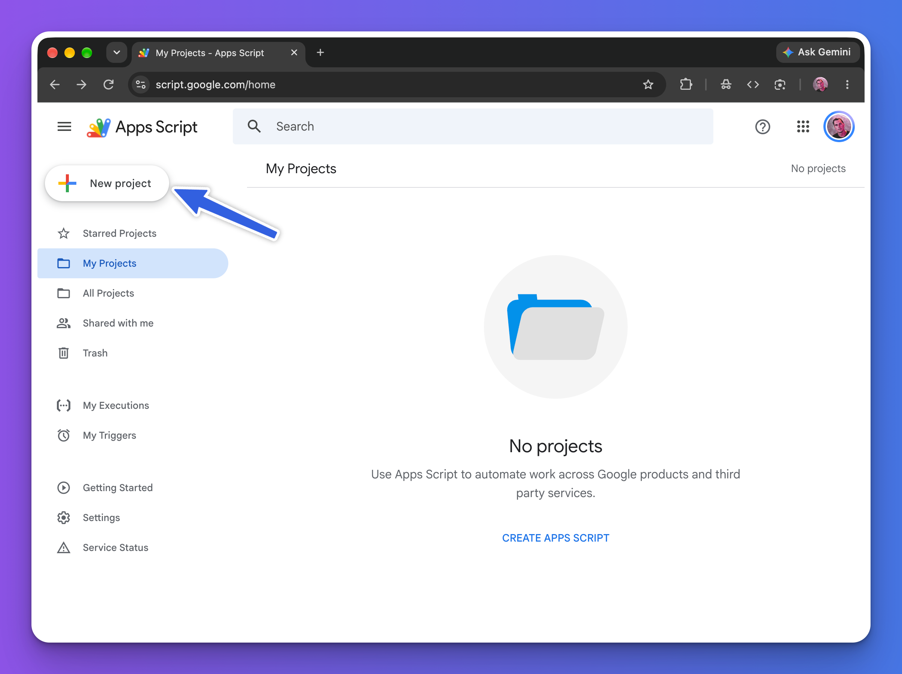

**What this does:** creates a standalone script in your Google account. The
script is not yet deployed and has no Gmail access.

**Expected result:** the Apps Script editor opens with a default file named
`Code.gs` and a small `myFunction` example.

## Step 2 — Give the project a recognizable name

Select **Untitled project** at the top of the editor, enter `jevMail`, and select
**Rename**.

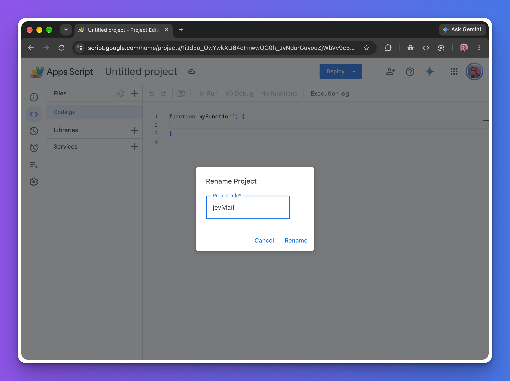

The name is only for identifying the project in your Google account. It does
not change Gmail labels or the deployed URL.

**Expected result:** `jevMail` appears beside the Apps Script logo.

## Step 3 — Enable the Gmail API service

In the left sidebar:

1. Select the **+** icon next to **Services**.
2. Select **Gmail API** from the service list.
3. Keep version `v1` and identifier `Gmail`.
4. Select **Add**.

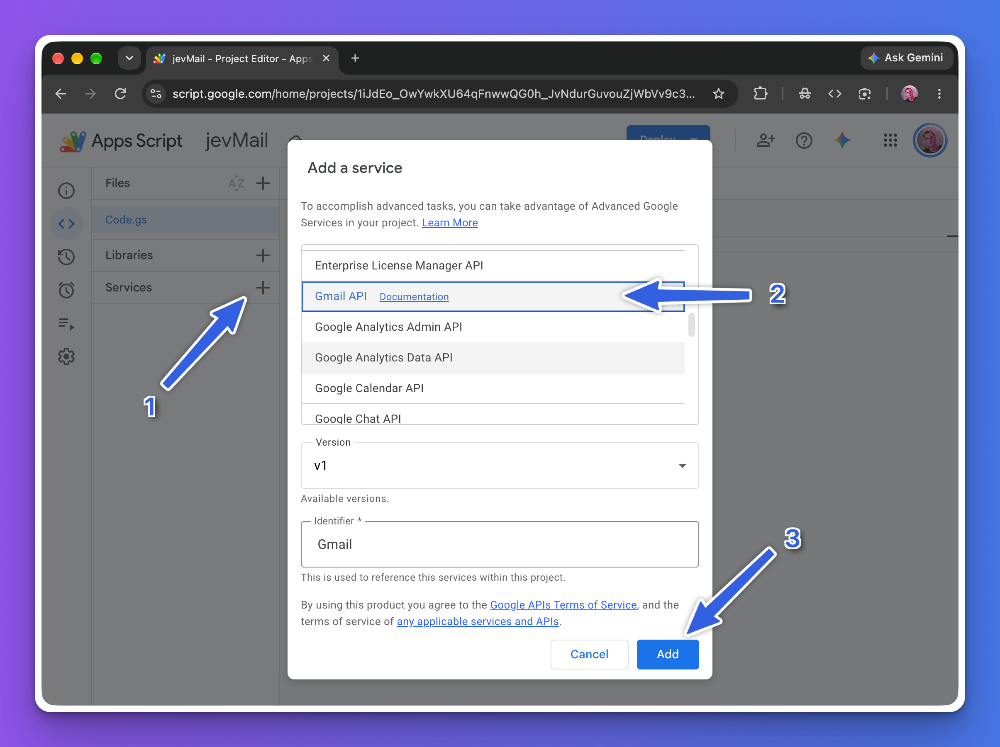

jevMail uses the advanced Gmail service to list messages, read metadata and
text when needed, create labels, apply labels, and remove the `INBOX` label when
you explicitly enable archiving.

If the project uses Apps Script's default Google Cloud project, adding the
service normally enables the corresponding API automatically. Projects linked
to a separate standard Cloud project may also need Gmail API enabled in Google
Cloud Console. See Google's
[Advanced Google services guide](https://developers.google.com/apps-script/guides/services/advanced).

**Expected result:** `Gmail` appears under **Services** in the editor sidebar.

## Step 4 — Replace the sample code with jevMail

Open `Code.gs`, select all existing sample code, and replace it with the complete
contents of this repository's [`CODE.gs`](CODE.gs). Save the project with the
disk icon or your browser's save shortcut.

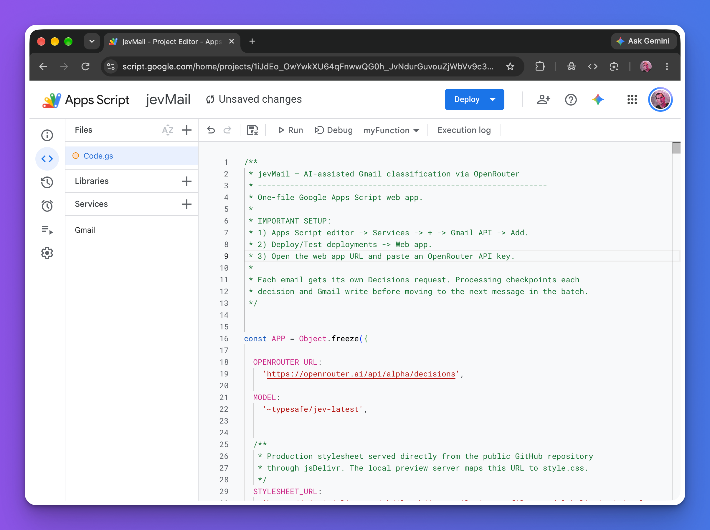

Copy the entire file, including the `doGet()` function and embedded interface.
Do not paste `README.md`, `guides.md`, `server.js`, or the local test files into
Apps Script. The production UI loads its stylesheet from the repository through
jsDelivr, so no separate HTML or CSS file is required in the Apps Script editor.

**Expected result:** the editor shows the jevMail source and no longer contains
the default `myFunction` example. Wait until the save indicator shows that the
project is saved before deploying.

## Step 5 — Start a web app deployment

At the top-right of the editor:

1. Select **Deploy → New deployment**.
2. Select the gear icon beside **Select type**.
3. Choose **Web app**.

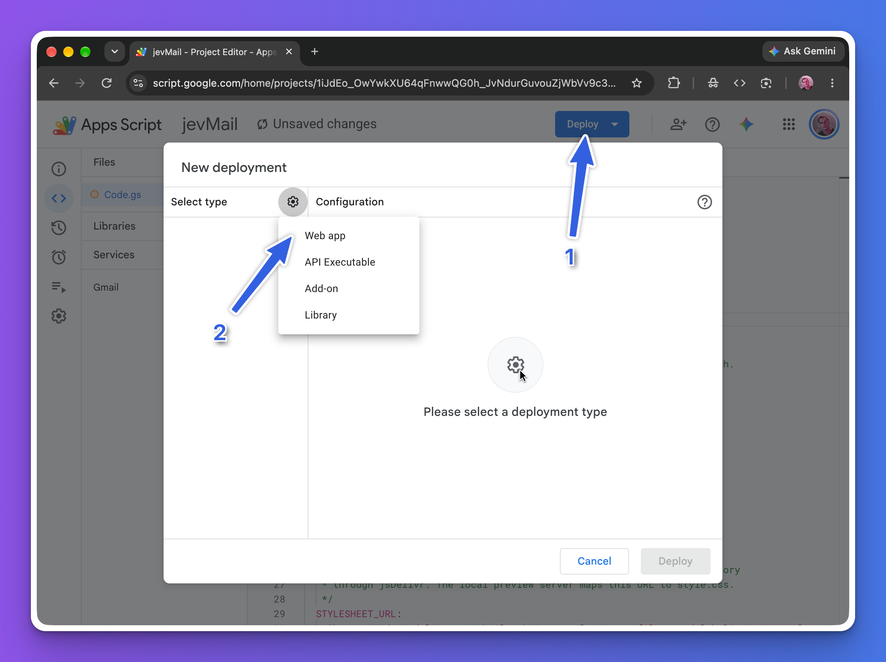

Apps Script web apps expose the `doGet()` interface through a Google-hosted URL.
This is the URL you will use to open jevMail.

**Expected result:** the deployment dialog displays the Web app configuration
fields.

## Step 6 — Configure the private deployment

Use these values:

| Field | Recommended value | Why |
| --- | --- | --- |
| Description | `jevMail` or a version note | Helps identify this deployment later. |
| Execute as | **Me** | Runs against the Gmail account that owns and deploys the project. |
| Who has access | **Only myself** | Keeps a personal installation private. |

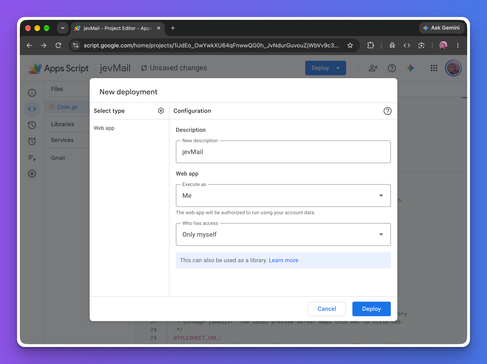

Select **Deploy**. If **Only myself** is not available on your Google Workspace
account, choose the narrowest option your administrator allows and do not share
the web app URL.

**Expected result:** Apps Script asks you to authorize access.

## Step 7 — Begin Google authorization

Select **Authorize access**.

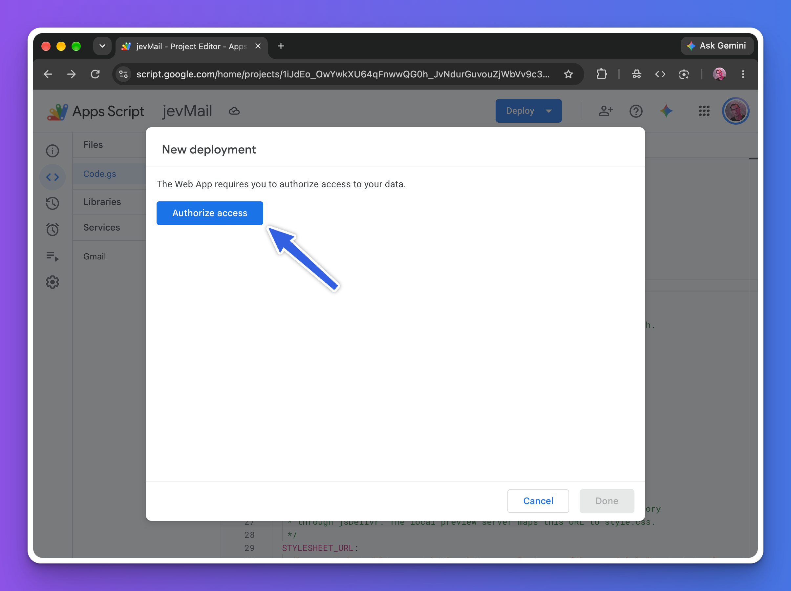

Choose the same Google account that owns the Apps Script project and the Gmail
inbox you want to process. Using a different account can produce permission
errors or connect the app to the wrong mailbox.

**Expected result:** Google displays either the permission screen directly or
an unverified-app warning first.

## Step 8 — Handle the unverified-app warning safely

A personal Apps Script project has not gone through Google's public app
verification, so Google may show **Google hasn't verified this app**.

If, and only if, you created this project and reviewed the source code:

1. Select **Advanced**.
2. Select **Go to jevMail (unsafe)**.

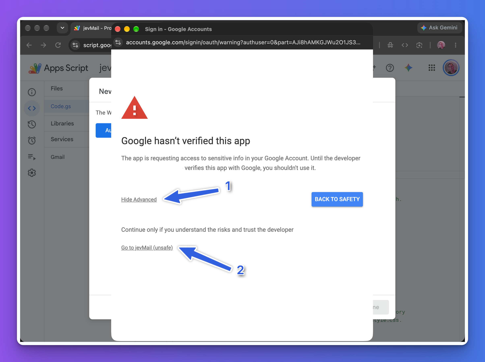

The word “unsafe” here indicates that the private project is not publicly
verified by Google. It does not validate the copied source. Stop if the project
name, Google account, or source is not the one you expect.

Google explains this screen in its
[Unverified apps documentation](https://support.google.com/cloud/answer/7454865).

**Expected result:** Google opens the detailed permission consent screen.

## Step 9 — Review and grant the required permissions

Review every permission before continuing. Select the requested permissions,
then select **Continue**.

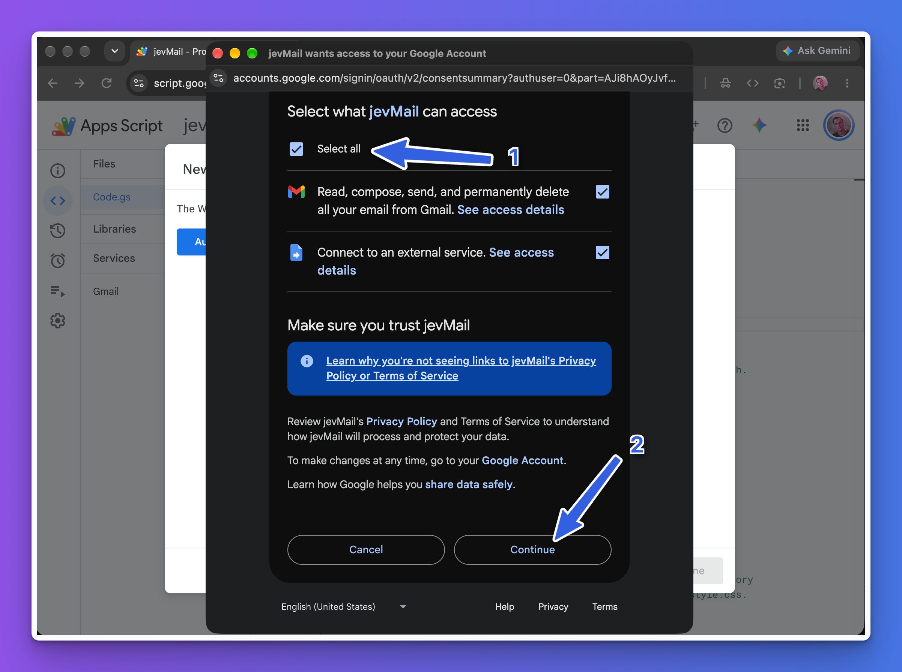

The consent screen can use broad language because Apps Script's Gmail API scope
covers many Gmail operations. In the supplied implementation, jevMail uses
Gmail access to read selected messages, create and apply labels, and optionally
archive by removing the `INBOX` label. The application does not call Gmail's
send, permanent-delete, or trash endpoints. **Connect to an external service**
allows the script to call OpenRouter for classification.

You can later revoke the project's access from your
[Google Account permissions](https://myaccount.google.com/permissions).

**Expected result:** authorization completes and Apps Script finishes creating
the deployment.

## Step 10 — Open and save the web app URL

After deployment succeeds, use the URL listed under **Web app**. Select the URL
to open jevMail, or select **Copy** and paste it into a new browser tab. Keep the
URL private.

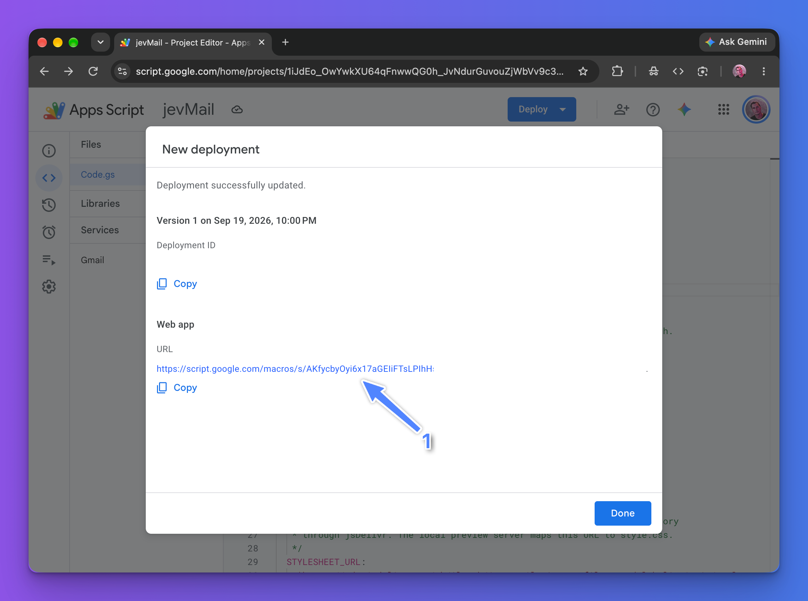

The production URL normally ends in `/exec`. A `/dev` URL from **Test
deployments** is intended for development and only works for users who can edit
the script.

Select **Done** after you have saved the URL. You can find it again under
**Deploy → Manage deployments**.

**Expected result:** the jevMail dashboard opens in a new tab.

## Step 11 — Open the OpenRouter connection panel

The first screen contains the OpenRouter connection and processing settings.

Select **Create API key** to open the OpenRouter Keys page in a new tab. You can
also open [OpenRouter Keys](https://openrouter.ai/workspaces/default/keys)
directly. Sign in to the OpenRouter account that will pay for jevMail model
usage.

Keep the jevMail tab open so you can return after creating the key.

**Expected result:** OpenRouter displays the API Keys page for your default
workspace.

## Step 12 — Create a restricted OpenRouter key and run a safe preview

On the OpenRouter API Keys page, select **New Key**. Configure a dedicated key
for this installation instead of reusing a general-purpose key.

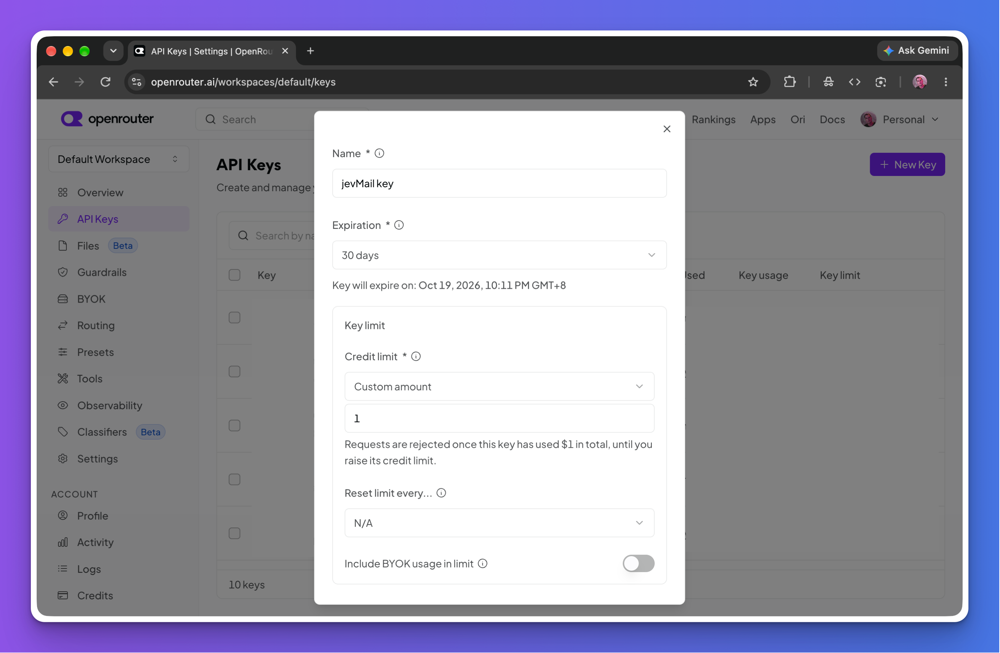

### Configure the key

Use these fields as a safe starting point:

| Field | Suggested first-run value | Purpose |
| --- | --- | --- |
| Name | `jevMail` | Makes usage easy to identify and lets you revoke only this application. |
| Expiration | `30 days` | Limits how long a copied or forgotten key can remain valid. Rotate or extend it after validation. |
| Credit limit | `Custom amount` | Enables a key-specific spending ceiling. |
| Custom amount | `$1` | Provides enough room for testing while limiting this key's total OpenRouter spend. |
| Reset limit every | `N/A` | Treats `$1` as a cumulative limit until you manually raise it. |
| Include BYOK usage in limit | Off | Leave off unless you configured your own provider keys and want that usage counted against this limit. |

The amount is denominated in US dollars. With **Reset limit every: N/A**,
OpenRouter rejects new requests after the key has used the configured amount in
total. If you deliberately want a recurring allowance, choose daily, weekly, or
monthly reset; OpenRouter documents that recurring resets occur automatically
at midnight UTC.

> [!IMPORTANT]
> The OpenRouter key limit and jevMail's **Maximum processing cost** solve
> different problems. The OpenRouter limit caps usage for this key across runs.
> The jevMail setting is a conservative guard for one processing session. Keep
> both controls enabled.

Finish creating the key, then copy the full `sk-or-v1-...` value immediately.
OpenRouter shows the plaintext key only when it is created. Do not place it in
`CODE.gs`, commit it to GitHub, include it in screenshots, or share it with
another person.

The limit can be changed later from the API Keys page. You can also disable or
delete only the jevMail key without affecting keys used by other applications.
See OpenRouter's
[API key documentation](https://openrouter.ai/docs/api/api-reference/api-keys/create-keys)
for the current limit and reset behavior.

### Connect the new key to jevMail

1. Return to the jevMail tab.
2. Paste the copied key into **OpenRouter API key**.
3. Keep **Store this key in Apps Script User Properties for future sessions**
   enabled if you want the key stored in your Google Apps Script user
   properties. Clear the checkbox to keep it only in the current browser tab.
4. Select **Verify connection**.

A successful test displays the selected label, confidence, and estimated or
reported request cost. Use OpenRouter's own key or account spending limit as an
additional billing control.

### Choose the first-run settings

Use a small, non-destructive validation run:

| Setting | First-run value |
| --- | --- |
| Email source | `Inbox` |
| Message limit | `10 — validation sample` |
| Maximum processing cost | `$0.01–$0.10` |
| Processing mode | `Apply labels only` |
| Process unread messages only | Enabled |
| Preview only | Enabled |

Preview mode sends the selected message data for classification but does not
create labels, apply labels, or archive messages in Gmail.

### Review the label system

Open **Labels** from the sidebar. The **Universal inbox** playbook is a balanced
default for mixed personal and professional mail. You can select a specialized
playbook, choose **Load into editor**, and edit every label and criterion.

Before processing, check that:

- categories describe observable evidence rather than vague importance;
- overlapping categories include clear exclusions;
- the `review` fallback remains available for ambiguous legitimate mail; and
- only low-risk unwanted categories are marked **Archive eligible**.

Select **Save classification rules** after editing.

### Run and inspect the preview

Open **Message processing** and select **Start processing**. Keep the tab open
while the session runs. Review:

- the selected label for each message;
- Jev confidence;
- whether metadata or full content produced the decision;
- predicted Gmail actions;
- total processing cost; and
- any reported errors.

Adjust label descriptions if messages land in the wrong category. When the
preview is consistently useful, disable **Preview only** and run another sample
with **Apply labels only**. Enable **Apply labels and archive eligible messages**
only after reviewing repeated real results. Archiving removes the `INBOX` label;
it does not delete the message, and the message remains in All Mail.

## Updating jevMail later

1. Open the existing Apps Script project.
2. Replace `Code.gs` with the new reviewed contents of [`CODE.gs`](CODE.gs).
3. Save the project.
4. Open **Deploy → Manage deployments**.
5. Edit the existing web app deployment.
6. Select **New version**, then select **Deploy**.

The existing `/exec` URL remains the entry point. Saved rules and a saved API
key remain in Apps Script User Properties unless you remove them in the app or
delete the project.

## Troubleshooting

### `Gmail is not defined`

The Gmail advanced service is missing. Repeat Step 3 and confirm `Gmail` appears
under **Services**.

### The page says authorization is required

Open the deployment while signed in to the account that owns the project, then
complete Steps 7–9. Google Workspace administrators can restrict Apps Script or
external requests; contact the administrator if the consent screen is blocked.

### The web app shows an old version

Saving `Code.gs` does not update an existing production deployment by itself.
Create a new deployment version using the update procedure above, then reload
the `/exec` URL.

### The interface has no styling or logo

The deployed page must be able to load public assets from GitHub/jsDelivr.
Confirm that the repository is public, `style.css` exists on the `main` branch,
and your browser or network is not blocking the CDN.

### OpenRouter verification fails

Confirm that the key is complete, active, and has available balance. Review
[OpenRouter activity](https://openrouter.ai/activity) and your key's spending
limits. You can remove a stored key with **Remove saved key** and connect again.

### Processing stops at the cost limit

Unfinished messages remain unchanged. Start a new session with an appropriate
budget after reviewing the prior results and OpenRouter activity.

## Security checklist

- Deploy the app from a project you own.
- Keep **Who has access** set to the most restrictive available option.
- Keep the deployment URL private.
- Use a dedicated OpenRouter key with a spending limit.
- Start with Preview only and Apply labels only.
- Review representative results before allowing archive actions.
- Revoke Google access and delete the stored OpenRouter key if you stop using
  the application.

For the product overview, privacy model, label playbooks, and technical links,
return to the [jevMail README](README.md).
